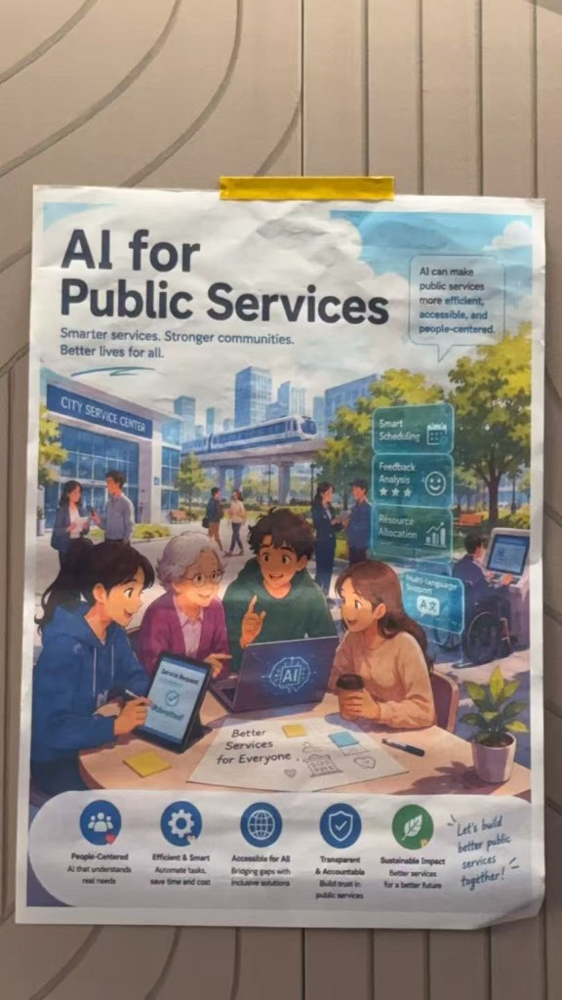
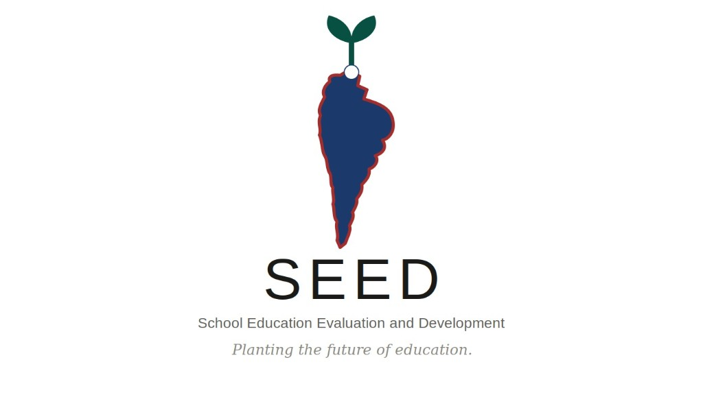

# Team 3 — AI for Public Services

**AI Collision Lab | TGYD × ATOX AI4SDGs 6-Hour Mini Hackathon**

**Smarter services. Stronger communities. Better lives for all.**

> AI can make public services more efficient, accessible, and people-centered.

| | |
|---|---|
| **Date** | 3 July 2026 · 09:30–18:00 |
| **Venue** | Holiday Inn Suites Shanghai Changfeng, Meeting Room |
| **Challenge track** | AI for Public Services |
| **Showcase** | [AI Party Night](docs/handbook/handbook.md#from-3-july-to-7-july-build-first-showcase-next) · 7 July · Beijing |

---

## About

We are **Team 3** at **AI Collision Lab**, a hands-on co-creation challenge within the Tsinghua Global Youth Dialogue programme. Hosted by Tsinghua University and organised by the Center for Global Competence Development and [ATOX](https://portfolio.attrax.ai/), the hackathon brings together cross-cultural, interdisciplinary teams to build something real in one day.

Our chosen track is **AI for Public Services** — using AI to make public information, community services, education, health support, and government-facing processes more **accessible**, **efficient**, and **user-friendly**.

**3 July** is the building day. **7 July** is the showcase day — our project will be presented at AI Party Night in Beijing (45-second lightning talk + Prototype Bazaar).



## Our Project: SEED



**SEED** stands for **School Education Evaluation and Development**.

It is our hackathon concept for making education-resource decisions more accessible and effective through data. SEED combines school reporting, diagnostic analysis, and natural-language decision support so governments, NGOs, administrators, and researchers can better understand where support is needed and how resources should be allocated.

For the fuller project story, see [`StoryofSeed.md`](StoryofSeed.md).

Team photos from the build day (for pitch, poster, and social):

**[docs/assets/team-session/](docs/assets/team-session/)** — 8 behind-the-scenes shots with a [usage guide](docs/assets/team-session/README.md)

Our ideation and planning live on our shared FigJam board:

**[Public Service — FigJam Board](https://www.figma.com/board/GA8K6Sc4JSk0qS4sq37kKQ/Public-Service?node-id=0-1&p=f&t=T9HnPqjfQ9nJj71p-0)**

---

## Participant Handbook

The full event handbook is exported locally for offline reference (including embedded images):

**[docs/handbook/handbook.md](docs/handbook/handbook.md)**

Source document on Feishu:

**[AI Collision Lab Participant Handbook](https://kcnz9o3vxzly.feishu.cn/docx/JhQkddTISouxgaxgM3GcIPsanHG)**

---

## Today's Schedule & Checkpoints

| Time | Session | Checkpoint |
|------|---------|------------|
| 09:30–10:00 | Registration & team check-in | Confirm roles |
| 10:00–10:15 | Opening & challenge briefing | Understand tracks, deliverables, judging |
| 10:15–11:00 | Tool bootcamp | Pick tools & deployment approach |
| 11:00–12:00 | Working lunch & team sprint | **11:30** — confirm team, track, roles · **12:00** — problem definition, target users, user journey, build plan |
| 12:00–14:00 | Build Sprint I | First working prototype or clickable flow |
| 14:00–15:30 | Build Sprint II | Incorporate feedback; clarify meaningful AI use |
| 15:30–16:00 | Build Sprint III | Poster draft, screenshots, demo link / QR code |
| **16:00–16:30** | **Final submission** | **Submit form + gallery by 16:30** |
| 16:30–17:00 | Pitch preparation | 3-minute pitch, backup demo ready |
| 17:00–18:00 | Pitch session | Live demo + presentation (English preferred) |

---

## Our Track

| | |
|---|---|
| **Challenge track** | AI for Public Services |
| **Related SDGs** | [SDG 3](https://sdgs.un.org/goals/goal3) Good Health and Well-being · [SDG 4](https://sdgs.un.org/goals/goal4) Quality Education · [SDG 11](https://sdgs.un.org/goals/goal11) Sustainable Cities and Communities · [SDG 16](https://sdgs.un.org/goals/goal16) Peace, Justice and Strong Institutions |
| **What it means** | Use AI to improve how people discover, understand, and use public services |

Example directions from the hackathon brief:

- A **multilingual public-service navigator**
- An **AI assistant** for finding local health, education, or legal-support resources
- A tool that **simplifies public forms and policy information** for young people

The strongest projects start from a **concrete user need**, use AI **meaningfully**, and propose a solution that could be **tested or further developed** after the hackathon.

### Our Core Pillars

| Pillar | What it means |
|--------|---------------|
| **People-Centered** | AI that understands real needs |
| **Efficient & Smart** | Automate tasks, save time and cost |
| **Accessible for All** | Bridging gaps with inclusive solutions |
| **Transparent & Accountable** | Build trust in public services |
| **Sustainable Impact** | Better services for a better future |

---

## Project Direction

> **Status:** Story and prototype direction defined — supporting materials in [`StoryofSeed.md`](StoryofSeed.md) and [FigJam](https://www.figma.com/board/GA8K6Sc4JSk0qS4sq37kKQ/Public-Service?node-id=0-1&p=f&t=T9HnPqjfQ9nJj71p-0)

### Project Snapshot

| | |
|---|---|
| **Project name** | **SEED** |
| **Full name** | School Education Evaluation and Development |
| **Tagline** | *Planting the future of education.* |
| **Demo** | [Try the SEED platform](https://37f7ba50441f48ff808dfbcadd92d0be.prod.enterapp.pro/) |
| **Concept note** | [StoryofSeed.md](StoryofSeed.md) |

### Problem Statement

Education systems often allocate resources through broad, traditional processes that do not fully reflect the real conditions of individual schools. This creates a gap between where support is sent and where need is greatest. At the same time, school and government teams spend significant time collecting data through fragmented reporting workflows, while decision-makers and NGOs still struggle to turn that data into timely, evidence-based action.

### Proposed Solution

We are building **SEED**, an open platform for data-driven education evaluation and development. SEED brings together three connected capabilities:

1. A **decision dashboard with natural-language querying** for governments and NGOs to explore school conditions and prioritize resource allocation.
2. **AI-assisted reporting tools** for schools and administrators to collect, structure, and summarize school-quality data more efficiently, including concepts such as an AI classroom quality inspector.
3. A **research-facing dataset API and advanced analytics layer** for researchers and policy analysts studying education equity and better public-service interventions.

AI adds value by making complex, fragmented education data easier to collect, easier to interpret, and easier to act on.

### Target Users

- Government agencies and local education authorities
- NGOs, foundations, and education-sector partners
- School administrators and reporting teams
- Researchers and policy analysts working on education equity
- Sponsors and collaborators interested in evidence-based public-service innovation

### Why This Direction

SEED is inspired by the data-driven school-index approach summarized in [`docs/school-index-brief.md`](docs/school-index-brief.md). Our goal is to show how better data infrastructure can support fairer, more accountable, and more effective public-service delivery in education.

---

## Submission Checklist

All items due by **16:30** on 3 July.

- [ ] **[Project Information Form](https://kcnz9o3vxzly.feishu.cn/share/base/form/shrcn8tdtIPX37jqgKGiqpaDezd)** — project name, team, track, description, demo link
- [ ] **[Gallery upload](https://portfolio.attrax.ai/shanghai)** — public-facing project page
- [ ] **Public dynamic demo link** — must work without a local laptop (Enter.pro, Vercel, Netlify, etc.)
- [ ] **Static project poster** — vertical roll-up (80 × 200 cm); include QR code to live demo
- [ ] **Social media post** — `#ATOX #Tsinghua #TGYD`; submit link or screenshot with the form
- [ ] **3-minute pitch** — problem, user, AI integration, prototype, next steps (English preferred)
- [ ] **Backup demo** — recorded screen video or screenshots in case of network issues

---

## Judging Criteria

| Criterion | Weight | What judges look for |
|-----------|--------|----------------------|
| Innovation and Creativity | 25% | Novel approach; fresh angle on the problem |
| AI Integration | 25% | AI meaningfully at the core, not superficial |
| Real-World Impact | 20% | Genuine community need; strong user understanding |
| Technical Execution | 20% | Functional, reliable prototype |
| Presentation and Pitch | 10% | Clear, persuasive 3-minute presentation |

---

## Tools & Credits

Each participant receives **USD 30 in Enter.pro credits** for the event.

- **Enter.pro registration** (use official invitation link only): [enter.converge.ai](https://enter.converge.ai?link_id=323&utm_campaign=attrax&utm_medium=community&utm_source=event&utm_term=july&gift=0LCFVWGDMD&inviter=Libby)
- **Portfolio examples**: [portfolio.attrax.ai](https://portfolio.attrax.ai/)
- **Recommended tools**: Cursor, Enter.pro, Vercel, Netlify, Claude/GPT APIs — see [handbook §7.2](docs/handbook/handbook.md#72-recommended-ai-tools-for-the-build-sprint) for full list

---

## Team Portfolio

### Jimmy HUNG

- Ex-Software Engineer
- HKUST Year 4, Innovation, Design & Technology
- Fostered 5+ award-winning interdisciplinary teams using a research-backed framework

### Sim Jie

- Marketing
- University of Hertfordshire
- _(TBC)_

### Ken

- Thai Government Officer
- PhD in Education
- _(TBC)_

### Janis

- Experience in Business Development
- Trading, Business
- _(TBC)_

Team roster: [7.3 Team Information Sheet](https://kcnz9o3vxzly.feishu.cn/sheets/MHDTsFhsVhqcGNtO6w3cfNPBnFg)

---

## Tech Stack

- Vite + React + TypeScript
- Tailwind CSS
- Lucide React icons
- Static docs and showcase assets under `docs/`
- Legacy mirrored Enter.pro export under `demo/`

---

## Getting Started

Run the React showcase locally:

```bash
npm install
npm run dev
```

Open the local Vite URL shown in terminal (usually `http://127.0.0.1:5173/`).

Create a production build:

```bash
npm run build
npm run preview
```

Legacy option: the live Enter.pro demo is still mirrored under `demo/` and can be served with:

```bash
python3 demo/serve.py
```

See [`demo/README.md`](demo/README.md) for mirror details.

### Deploy the landing page (public link)

**Automatic (GitHub Pages)** — push to `main` after enabling Pages:

1. GitHub repo → **Settings** → **Pages**
2. **Build and deployment** → Source: **GitHub Actions**
3. Push to `main` — workflow [`.github/workflows/deploy-pages.yml`](.github/workflows/deploy-pages.yml) publishes the site

Public URL:

**https://jim-books.github.io/Team3PublicService/**

**Manual (Vercel — custom domain friendly)**

```bash
npm run deploy:vercel
```

First run opens browser login. Vercel settings: build `npm run build`, output `dist`.

**Manual (Netlify)**

```bash
npm run deploy:netlify
```

Config is in [`netlify.toml`](netlify.toml). [`vercel.json`](vercel.json) is included for Vercel.

Production assets live under `public/` (logo, photos, concept image) and are copied into `dist/` on build.

---

## Links

| Resource | URL |
|----------|-----|
| Story of SEED | [StoryofSeed.md](StoryofSeed.md) |
| School index concept brief (local) | [docs/school-index-brief.md](docs/school-index-brief.md) |
| Participant handbook (local) | [docs/handbook/handbook.md](docs/handbook/handbook.md) |
| Participant handbook (Feishu) | [Feishu doc](https://kcnz9o3vxzly.feishu.cn/docx/JhQkddTISouxgaxgM3GcIPsanHG) |
| FigJam — Public Service board | [Figma board](https://www.figma.com/board/GA8K6Sc4JSk0qS4sq37kKQ/Public-Service?node-id=0-1&p=f&t=T9HnPqjfQ9nJj71p-0) |
| Event registration (Luma) | [luma.com/3ivc03mk](https://luma.com/3ivc03mk) |
| Project submission form | [Feishu form](https://kcnz9o3vxzly.feishu.cn/share/base/form/shrcn8tdtIPX37jqgKGiqpaDezd) |
| Project gallery | [portfolio.attrax.ai/shanghai](https://portfolio.attrax.ai/shanghai) |
| SEED live demo | [Enter app](https://37f7ba50441f48ff808dfbcadd92d0be.prod.enterapp.pro/) |
| Enter.pro (event credits) | [enter.converge.ai](https://enter.converge.ai?link_id=323&utm_campaign=attrax&utm_medium=community&utm_source=event&utm_term=july&gift=0LCFVWGDMD&inviter=Libby) |
| Team information sheet | [Feishu sheet](https://kcnz9o3vxzly.feishu.cn/sheets/MHDTsFhsVhqcGNtO6w3cfNPBnFg) |
| UN SDGs | [sdgs.un.org/goals](https://sdgs.un.org/goals) |

---

*Let's build better public services together.*
