# AI Collision Lab｜TGYD × ATOX AI4SDGs 6-Hour Mini Hackathon Participant Handbook

> # **Welcome**
>
> Welcome to **AI Collision Lab**, the **TGYD × ATOX AI4SDGs 6-hour Mini Hackathon** 🎉🎉🎉
>
> This is a space for ideas to collide across countries, disciplines, cultures, and lived experiences. Over one intensive day, you will work with your team to turn a real-world challenge into something tangible: a working website, a lightweight app, an AI workflow, or another prototype that people can actually experience.
>
> You do not need to be an engineer to contribute. Great projects need people who can define a problem, understand communities, design experiences, tell a compelling story, organise a team, and imagine what should exist next.
>
> Come curious, build boldly, and make something that matters.
>
> Before we begin, **please register for the event here**:
>
>  https://luma.com/3ivc03mk
>
> Your registration will help us better understand your interests and preferences, so we can prepare a more relevant and enjoyable experience for everyone tomorrow.

---

# **Event Background and Key Information**

## **Event Information**

**AI Collision Lab | TGYD × ATOX Mini Hackathon**

**⏰ Time：3 July 2026｜09:30-18:00**

**🏠 Venue：Holiday Inn Suites Shanghai Changfeng, Meeting Room**

**🚀 Host：**

- **Hosted by：**Tsinghua University
- **Organised by：**Center for Global Competence Development, Tsinghua University and ATOX

**🏟️ Participants：**TGYD youth delegates, together with invited members of local youth innovation communities.

**📃 Format：AI+X Mini Hackathon**

AI Collision Lab is a hands-on co-creation challenge within the Tsinghua Global Youth Dialogue programme. Participants will work in cross-cultural and interdisciplinary teams to explore real-world challenges through AI.

The goal is not simply to discuss AI. Each team is expected to develop a meaningful, experienceable project outcome, such as a usable website, lightweight application, AI Agent workflow, interactive product prototype, or service concept that can be further developed after the event.

---

## **From 3 July to 7 July: Build First, Showcase Next**

The Mini Hackathon on **3 July** is closely connected to the **AI Party Night** in Beijing on **7 July**.

### **3 July: AI Collision Lab**

This is the building day.

Teams will define a problem, identify users, develop a solution, and create a functional or experienceable prototype. By the end of the day, each team should have a clear product story, a dynamic demo, and the foundations for a project poster.

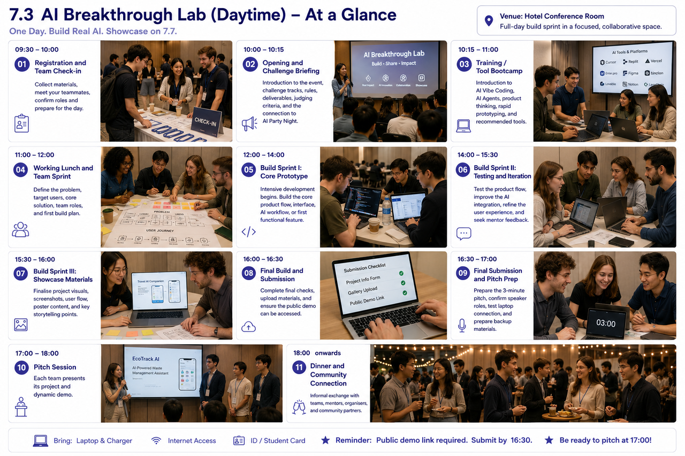

### **7 July: AI Party Night**

This is the showcase and connection day.

All team projects will be brought to the AI Party Night for two forms of presentation:

- **AI+X Lightning Showcase:** each team introduces its project in a short, high-energy presentation to the full audience. (45 seconds)
- **Prototype Bazaar:** teams display their project posters and engage directly with youth delegates, entrepreneurs, researchers, companies, and other innovation partners.

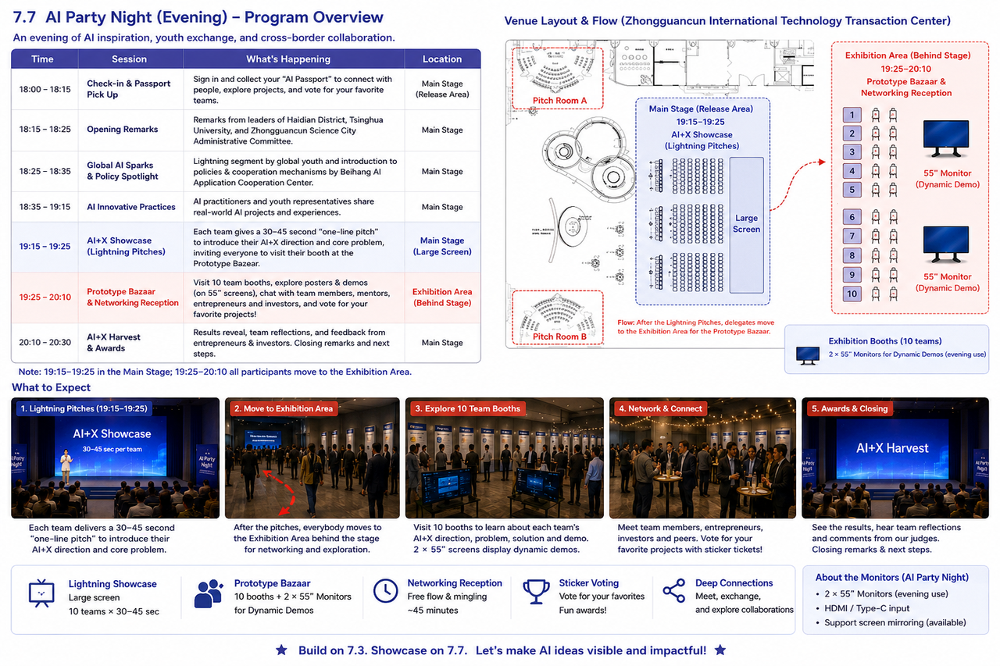

The Prototype Bazaar will also include dynamic project demonstrations through on-site screens. Teams may use the available display time to show their website, app, AI Agent, video prototype, or other live product experience.

**<u>3 July is where the project is built.7 July is where the project meets a wider audience.</u>**

---

# **Programme at a Glance — 3 July**

| **Time** | **Session** | **What Happens** | **Checkpoint** |
| --- | --- | --- | --- |
| 09:30–10:00 | Registration and Team Check-in | Collect materials, meet your teammates, confirm roles and prepare for the day. | - |
| 10:00–10:15 | Opening and Challenge Briefing | Introduction to the event, challenge tracks, rules, deliverables, judging criteria, and the connection to AI Party Night. | Teams understand the challenge tracks, submission requirements, judging criteria, and final public-demo requirement. |
| 10:15–11:00 | Training / Tool Bootcamp | Introduction to AI Vibe Coding, AI Agents, product thinking, rapid prototyping, and recommended tools. | Each team has identified the main tools and deployment approach it may use, such as Enter.pro, Vercel, Netlify, or another public deployment platform. |
| 11:00–12:00 | Working Lunch and Team Sprint | Define the problem, target users, core solution, team roles, and first build plan. | **By 11:30:** confirm team membership, project topic, challenge track, and team roles. **By 12:00:** complete a clear problem definition, identify target users, define the core user journey, and agree on the first build plan. |
| 12:00–14:00 | Build Sprint I: Core Prototype | Intensive development begins. Build the core product flow, interface, AI workflow, or first functional feature. | A first working prototype or clickable product flow is available. Teams should be able to demonstrate at least one key user journey. |
| 14:00–15:30 | Build Sprint II: Testing and Iteration | Test the product flow, improve the AI integration, refine the user experience, and seek mentor feedback. | The team has incorporated at least one round of feedback and clarified how AI is meaningfully used in the solution. |
| 15:30–16:00 | Build Sprint III: Showcase Materials | Finalise project visuals, screenshots, user flow, poster content, and key storytelling points. | Draft project poster content is complete; teams have selected screenshots, visuals, and the public project link or QR code. |
| 16:00–16:30 | Final Build and Submission | Complete final checks, upload materials, and ensure the public demo can be accessed. | Submit both required items by **16:30**: 1) Project Information Form; 2) Gallery upload. The public dynamic-demo link must work without access to a local computer. |
| 16:30–17:00 | Final Submission and Pitch Preparation | Prepare the 3-minute pitch, confirm speaker roles, test laptop connection, and prepare backup materials. | - |
| 17:00–18:00 | Pitch Session | Each team presents its project and dynamic demo. | Deliver a 3-minute pitch and demonstrate the project clearly, focusing on the problem, user, AI integration, prototype, and next steps. |
| 18:00 onwards | Dinner and Community Connection | Informal exchange with teams, mentors, organisers, and community partners. | Teams collect feedback, exchange contacts, and identify potential improvements or collaboration opportunities for the 7 July AI Party Night showcase. |

---

# **AI Vibe Coding**

## **What Is Vibe Coding?**

**Vibe Coding** is a fast, conversational way of creating digital products with AI.

Instead of starting by writing every line of code manually, you describe what you want to build in natural language. AI coding tools can help generate interfaces, logic, databases, workflows, and iterations. You remain responsible for the problem, the product decisions, testing, and the user experience.

For this Mini Hackathon, Vibe Coding can help teams quickly create:

- Websites and landing pages
- Lightweight web applications
- Interactive tools or dashboards
- AI-powered assistants
- Community services and workflow tools
- Data visualisations
- Early-stage product prototypes

The focus is not on producing the most complex code. The focus is on creating something that clearly addresses a real problem and can be meaningfully experienced.

## What You Can Build？

Check here：https://portfolio.attrax.ai/

## **Enter.pro Access**

**Enter.pro** is an AI product-building platform that helps teams quickly create and deploy websites, web apps, and interactive prototypes. Teams can publish their project online and receive a public link for demo, sharing, and later showcase.

For this Mini Hackathon, each participant will receive **USD 30 in Enter.pro credits** for use during the event.

**🔗 Link：**[https://enter.converge.ai?link_id=323&utm_campaign=attrax&utm_medium=community&utm_source=event&utm_term=july&gift=0LCFVWGDMD&inviter=Libby](https://enter.converge.aic?link_id=323&utm_campaign=attrax&utm_medium=community&utm_source=event&utm_term=july&gift=0LCFVWGDMD&inviter=Libby)

### **Registration Instructions**

1. Please register **only through the official invitation link provided by ATOX**.
1. Do not create an account through a separate public registration link, as credits may not be activated correctly.
1. Use a valid email address and complete registration before or during the Tool Bootcamp.
1. After registration, check that your event credits have been successfully added.
1. Teams are encouraged to submit their public Enter.pro project link as part of the final dynamic demo and include a QR code on the 7 July project poster.

Please bring your laptop, charger, and any accounts you may wish to use for AI tools or deployment platforms.

---

# **Challenge Tracks, Teams and Judging Criteria**

## **4.1 Challenge Tracks: AI for SDGs**

Teams may choose one direction below. The strongest projects will start from a concrete user need, use AI meaningfully, and propose a solution that could be tested or further developed after the Hackathon.

| **Challenge Track** | **Related SDGs** | **What It Means** | **Example Project Directions** |
| --- | --- | --- | --- |
| **AI for Public Services** | SDG 3 Good Health and Well-being; SDG 4 Quality Education; SDG 11 Sustainable Cities and Communities; SDG 16 Peace, Justice and Strong Institutions | Use AI to make public information, community services, education, health support, or government-facing processes more accessible, efficient, and user-friendly. | A multilingual public-service navigator; an AI assistant for finding local health, education, or legal-support resources; a tool that simplifies public forms and policy information for young people. |
| **AI for Inclusive Infrastructure** | SDG 9 Industry, Innovation and Infrastructure; SDG 10 Reduced Inequalities; SDG 11 Sustainable Cities and Communities | Explore how AI can help people access transport, public spaces, digital services, and essential infrastructure more fairly and safely. | An accessibility route planner; an AI tool that identifies barriers in public-space images; an inclusive transit guide for elderly people, persons with disabilities, or visitors unfamiliar with a city. |
| **AI for Youth Civic Action** | SDG 16 Peace, Justice and Strong Institutions; SDG 17 Partnerships for the Goals | Build tools that help young people understand issues, participate in community life, organise initiatives, or connect with decision-makers and local organisations. | A youth issue-reporting platform; an AI assistant that turns local concerns into actionable proposals; a community volunteering and campaign-matching tool; a platform for youth consultation and idea collection. |
| **AI for Climate Action** | SDG 13 Climate Action; SDG 12 Responsible Consumption and Production; SDG 17 Partnerships for the Goals | Use AI to help individuals, communities, and organisations understand climate risks, reduce emissions, adapt to change, or take practical climate action. | A personalised low-carbon lifestyle coach; an AI climate-risk explainer for communities; a tool that helps students track and reduce event-related waste; a climate education game or chatbot. |
| **AI for Green Cities** | SDG 11 Sustainable Cities and Communities; SDG 13 Climate Action; SDG 7 Affordable and Clean Energy | Develop solutions for cleaner, safer, more liveable urban environments, including mobility, waste, public spaces, energy use, and citizen participation. | A smart recycling guide; an AI-powered neighbourhood heat-map and cooling recommendation tool; a greener commuting planner; a citizen feedback tool for urban cleanliness, safety, or public-space improvements. |
| **AI for Sustainable Industry** | SDG 8 Decent Work and Economic Growth; SDG 9 Industry, Innovation and Infrastructure; SDG 12 Responsible Consumption and Production | Consider how AI can support small businesses, supply chains, responsible production, worker safety, resource efficiency, and sustainable entrepreneurship. | An AI assistant for small businesses to reduce packaging waste; a supply-chain transparency tool; a product-life-cycle or repair recommendation tool; an energy-efficiency assistant for small workshops or offices. |
| **AI for Cross-cultural Communication** | SDG 4 Quality Education; SDG 10 Reduced Inequalities; SDG 16 Peace, Justice and Strong Institutions; SDG 17 Partnerships for the Goals | Use AI to reduce language, cultural, and information barriers between people from different countries, communities, and professional backgrounds. | A context-aware multilingual dialogue assistant; an intercultural meeting facilitator; a tool that helps international students understand local services; an AI platform for cross-border team collaboration and knowledge sharing. |
| **AI for Cultural Heritage and Storytelling** | SDG 4 Quality Education; SDG 8 Decent Work and Economic Growth; SDG 11 Sustainable Cities and Communities | Explore how AI can help preserve, interpret, share, and reimagine cultural heritage, local stories, languages, and community knowledge. | An AI storytelling guide for a historic district; a multilingual heritage tour assistant; an oral-history archive with searchable summaries; a tool that helps young people create interactive stories from local traditions. |
| **AI for Digital Safety and Trust** | SDG 3 Good Health and Well-being; SDG 4 Quality Education; SDG 9 Industry, Innovation and Infrastructure; SDG 16 Peace, Justice and Strong Institutions | Build solutions that help users navigate misinformation, online harms, privacy risks, scams, biased content, and other digital trust challenges. | A scam or misinformation awareness assistant; a digital-safety guide for students and families; an AI tool that explains privacy terms in plain language; a platform that helps users verify claims and identify trustworthy sources. |
| **AI for Global Governance** | SDG 16 Peace, Justice and Strong Institutions；SDG 17 Partnerships for the Goals；SDG 10 Reduced Inequalities | Explore how AI can support cross-border collaboration, multilateral governance, policy transparency, and public understanding of global issues, helping citizens, institutions, and countries engage more effectively with global decision-making. | An AI assistant that explains international treaties or UN resolutions in plain language; a transparency tool that tracks the implementation of global commitments (e.g. climate pledges, aid funding flows); a multi-stakeholder negotiation simulator for practicing international consensus-building; a cross-country policy comparison tool that helps researchers or students quickly compare regulations and positions on the same issue. |

**Suggested Starting Point**

Before building, each team should be able to answer:

1. What specific problem are we addressing?
1. Who experiences this problem most directly?
1. Why is the current solution insufficient?
1. What role does AI play that is genuinely useful?
1. What can a user do with our prototype by the end of the day?

Teams are encouraged to connect their projects to a real city, community, public-service setting, campus environment, or cross-cultural experience they know firsthand.

## **4.2 Team Allocation**

Teams have already been formed in advance to encourage cross-cultural and interdisciplinary collaboration.

TEAM INFORMATION TABLE：[ 7.3 TEAM INFORMATION SHEET](https://kcnz9o3vxzly.feishu.cn/sheets/MHDTsFhsVhqcGNtO6w3cfNPBnFg)

**（Note：Each team member highlighted in red will serve as the Team Coordinator, responsible for coordinating the team, tracking progress, and ensuring that all required materials are submitted on time.）**

Each team includes a mix of backgrounds, perspectives, and strengths. You may have teammates with experience in technology, design, research, business, public policy, communication, sustainability, or community work.

Please use this diversity as an advantage. Assign roles early and make sure every member has a meaningful contribution.

Suggested team roles include: Project Lead + Product / UX Designer + AI Builder + Researcher + Community or Impact Lead + Storyteller / Pitch Lead

## **4.3 Judging Criteria**

| **Criterion** | **Weight** | **What We Look For** |
| --- | --- | --- |
| Innovation and Creativity | 25% | How novel and original is the solution? Does it approach the problem from a fresh angle? |
| AI Integration | 25% | Is AI meaningfully used at the core of the solution, rather than added superficially? How deep and appropriate is the AI use? |
| Real-World Impact | 20% | How relevant is the solution to genuine needs in communities, cities, institutions, or social contexts? How well does the team understand the problem and its users? |
| Technical Execution | 20% | How functional and complete is the prototype? Does the demo work reliably enough to communicate the intended experience? |
| Presentation and Pitch | 10% | Is the three-minute presentation clear, well-structured, and persuasive? Does the team communicate the value of the project effectively? |

---

# **Submission Requirements**

## 5.1 Submission Method

Each team must complete **three required submissions through the official links**.

Both submissions must be completed by **16:30**. The Pitch Session will begin at **17:00**.

**1）Submit the Project Information Form**

Each team must complete the official project information form, including:

- Project name / Team members / Challenge track / Short description of the solution / Demo link, prototype link, or video link...

**🔗 Link：****https://kcnz9o3vxzly.feishu.cn/share/base/form/shrcn8tdtIPX37jqgKGiqpaDezd**

**2）Upload the Project to the Gallery**

Each team must also upload its project to the official event Gallery.

The Gallery is the public-facing space where other participants, mentors, judges, and future collaborators can discover your project.

**🔗 Link : ****https://portfolio.attrax.ai/shanghai**

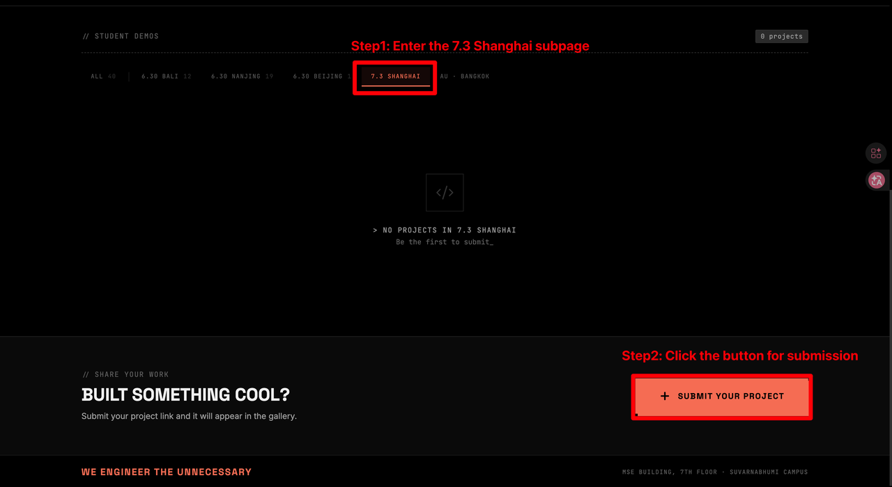

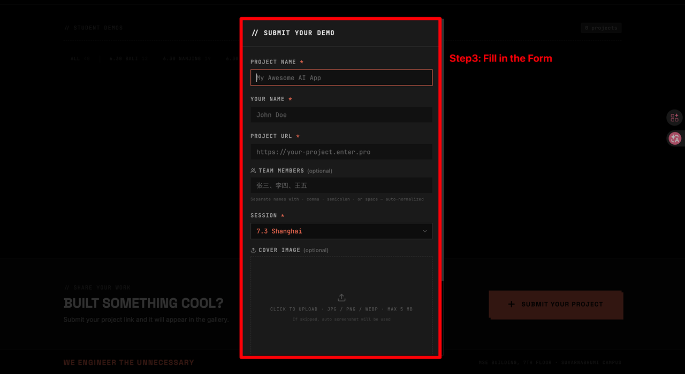

**3）Social Media Submission**

Each team should share at least one post during the event showing the build process, prototype, or project idea on platforms such as Instagram, X, Xiaohongshu, or LinkedIn.

Please include:

**#ATOX #Tsinghua #TGYD**

Submit the post link or screenshot together with the final Project Information Form.

## **5.2 Final Deliverables**

### **A. Dynamic Demo Prototype**

Each team must submit a **publicly accessible, online dynamic prototype**.

Your project must be available through a public link that organisers, judges, and visitors can open directly without accessing your local computer. Local-only projects, unpublished files, or prototypes that only run on one team member’s laptop will not be accepted as final submissions.

Your dynamic prototype may include:

- A working website or Web App
- A lightweight mobile or browser-based application
- An interactive prototype
- An AI Agent or AI workflow
- A live product walkthrough
- A demo video showing key user flows
- Another format that clearly demonstrates how the solution works in practice

Teams are encouraged to use AI product-building tools with public deployment capability, such as **Enter.pro**, or deploy their project through platforms such as **Vercel, Netlify, Railway, Hugging Face Spaces**, or similar services.

The key question is:

Can someone understand how a real user would use this project?

A slide deck alone is not sufficient. Your team should show a product, workflow, interface, or product experience that brings the idea to life.

### **B. Static Project Poster**

Each team must prepare one static project poster (It'll also be used  for the **7 July Prototype Bazaar)**

The design master file will be prepared by **ATOX **as follows(can be downloaded)

You are also welcome to use your own design tools（**<u>Figma、Canva...</u>**） and develop a visual style that best fits your project. However, please make sure your final design is prepared for a **vertical roll-up banner** display format. (**80 cm × 200 cm  is the most common size)**

Your poster may include:

- Project name / One-sentence project description
- The problem you are addressing
- Target users or communities
- Your AI-enabled solution
- Key functions or user journey
- Screenshots, diagrams, or demo visuals
- Team members
- ...

## **5.3 Pitch Requirements**

- Each team receives **exactly 3 minutes** for its presentation and live demo.
- Judge Q&A may follow, subject to the overall schedule.
- **English is preferred** for final presentations.
- All final presentations must be delivered through **one Static Project Poster or Live Demo** submitted in advance.
- Bring a backup version of your demo, such as a recorded screen video or screenshots, in case of network or device issues.

## **5.4 Submission Deadline**

**Final submission deadline: 16:30**

By 16:30, each team should submit:

1. One final Static Project Poster
1. A link to the working demo, website, prototype, or video
1. Required poster content or draft files, according to the organiser’s instructions

From **16:30–17:00**, teams should focus on pitch preparation, role allocation, and final technical checks.

The official **Pitch Session begins at 17:00**.

---

# **Poster Design Guidance**

Your poster is not only a summary of your project. It is a conversation starter for AI Party Night.

A strong poster should help someone understand your project in less than one minute.

**Show Cases**

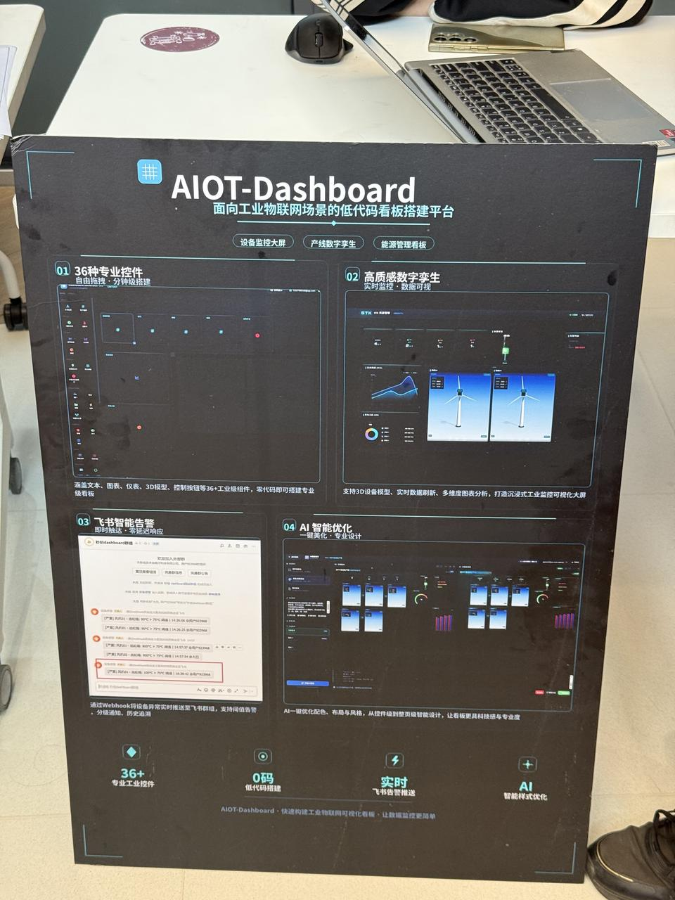

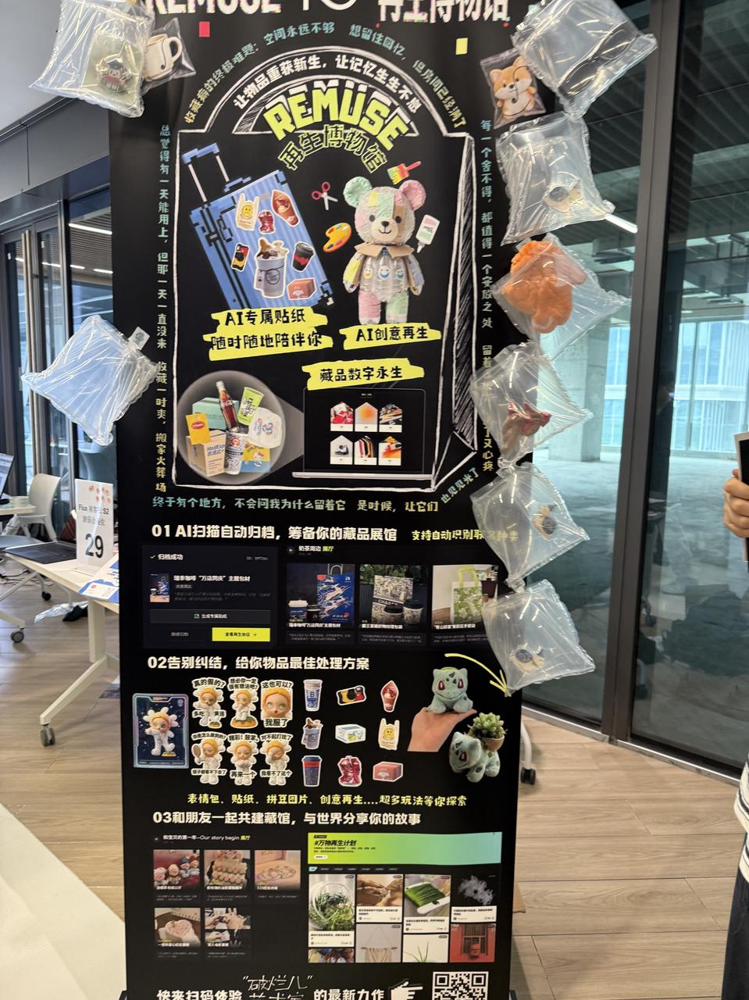

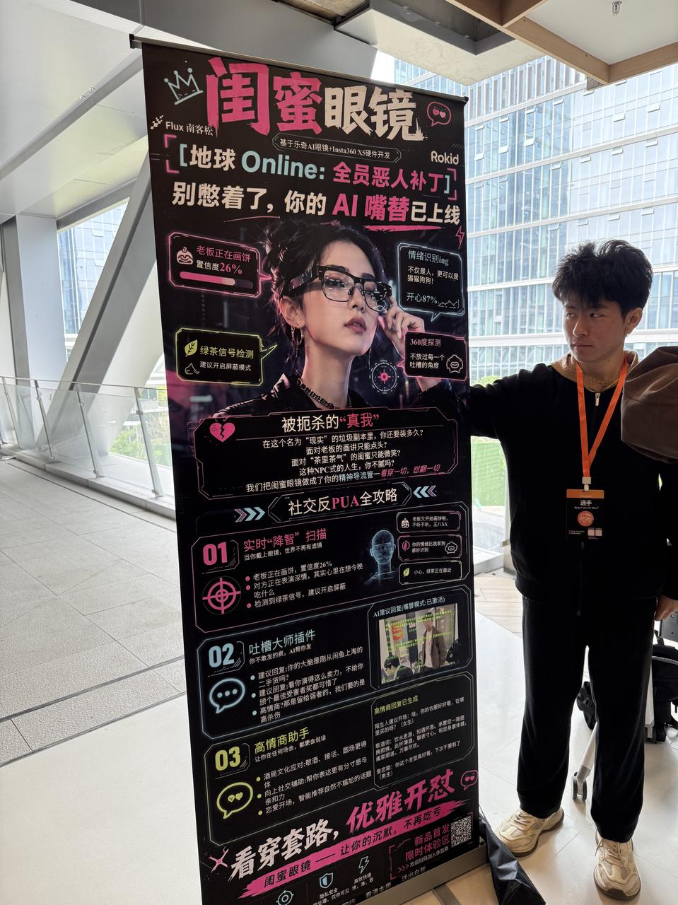

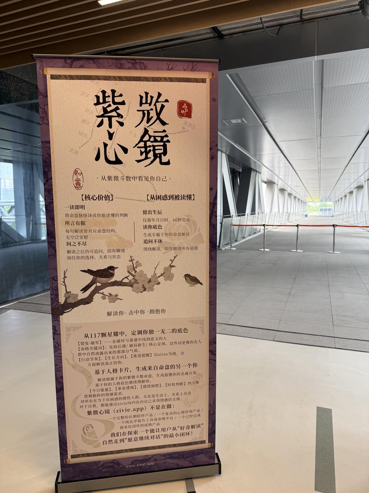

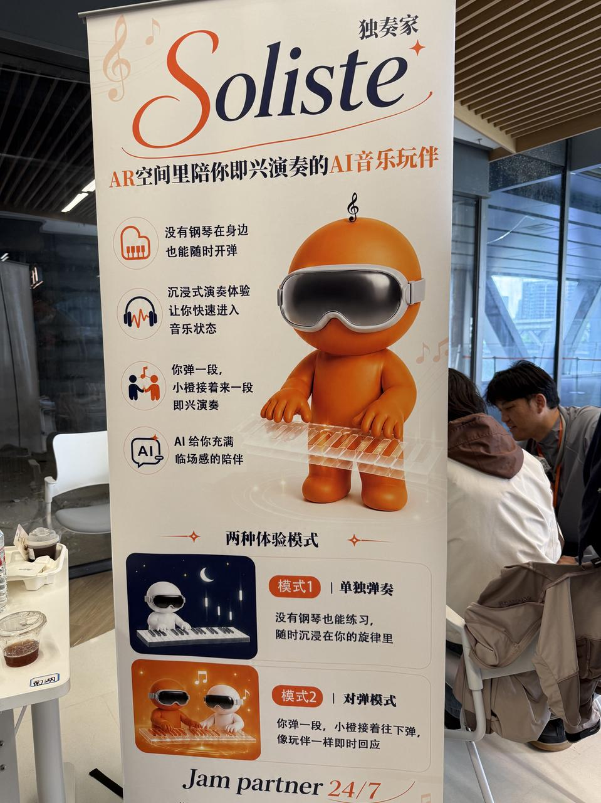

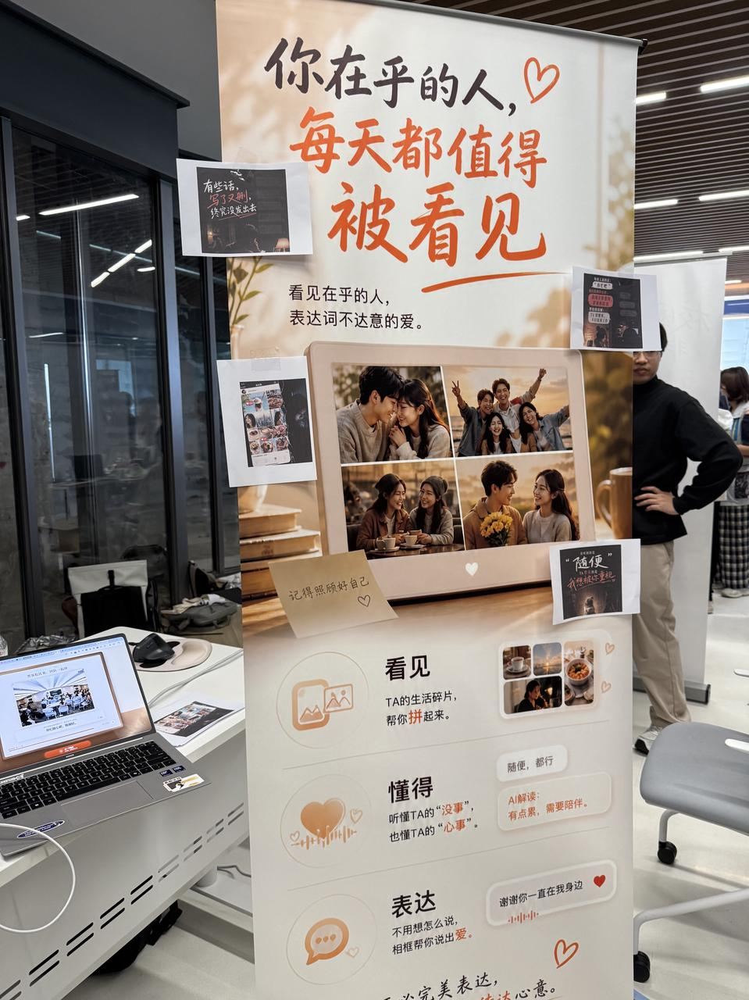

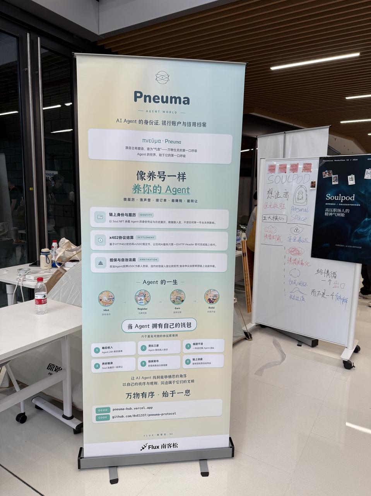

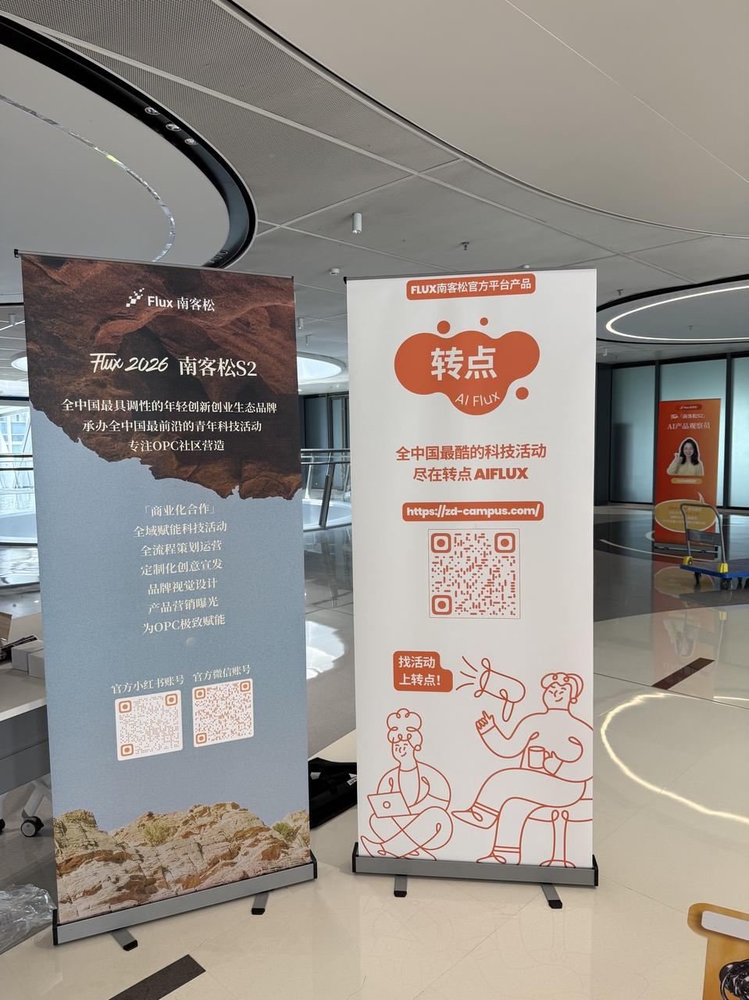

## **6.1 Recommended Structure**

**Top Section**

- Project name
- Short tagline
- Team name / team members

**Middle Section**

- The problem
- Target users
- Your solution
- How AI is used
- Key screenshots, diagrams, or product flow

**Bottom Section**

- Why it matters
- Current stage of the prototype
- Next step or collaboration needs
- QR code linking to the live demo, video, or project page

## **6.2 Design Principles**

- Keep text concise and visual hierarchy clear.
- Use large, readable headings.
- Show the product, not only the idea.
- Include screenshots or illustrations of the actual prototype.
- Avoid overcrowding the poster with long paragraphs.
- Make it easy for a visitor to ask: “Can you show me how this works?”
- Use a QR code wherever possible.

---

# **Technical Support**

The organisers and ATOX representatives will be available throughout the day to provide technical mentorship and support.

## **7.1 Available On-Site Support**

- **ATOX technical mentors:** available during the Build Sprint for AI product thinking, Vibe Coding, prototyping, and demo feedback.
- **Venue technical support:** assistance with projector connection, laptop connection, microphones, Wi-Fi, and other basic venue equipment.
- **Event operations support:** assistance with logistics, seating, materials, timing, and general event questions.

Please do not wait until the final minutes to test your demo. Ask for support early if you encounter technical difficulties.

## **7.2 Recommended AI Tools for the Build Sprint**

| **Category** | **Suggested Tools** |
| --- | --- |
| Vibe Coding / IDE | Cursor, Windsurf, VS Code + Copilot, Replit AI, Enter.pro |
| Language Models | Claude API, OpenAI GPT-4o, Gemini, Mistral, local LLMs |
| Multimodal AI | GPT-4V, Claude Vision, Gemini Pro Vision |
| Voice and Speech | Whisper, ElevenLabs, Google Speech-to-Text |
| Image Generation | DALL·E, Stable Diffusion, Midjourney |
| Fast Deployment | Vercel, Netlify, Railway, Hugging Face Spaces |
| Quick Databases | Supabase, Firebase, PlanetScale, Neon |

---

# **Reminders and Participation Rules**

**1）Please Bring**

All participants must bring:

- A **laptop and charger**
- A working email address for tool registration
- Headphones, adapters, or USB-C / HDMI converters if needed
- A stable mobile hotspot as backup, where possible

Your team’s final prototype must be accessible through a public link. Please do not rely only on a local project running on one laptop.

---

**2）Competition Rules**

- All project work should be primarily developed during the event. Existing open-source frameworks, APIs, templates, and tools may be used, but fully pre-built projects are not permitted.
- Projects must be original. Plagiarism, copying another team’s work, or presenting an existing project as newly created will result in disqualification.
- Teams must remain intact after final confirmation during the morning check-in. No transfers between teams are permitted.
- Teams must complete both required submissions by **16:30**:
- Teams must be present and ready for the Pitch Session beginning at **17:00**. Teams that do not attend their pitch slot may forfeit their opportunity to present.
- Final presentations should clearly explain the project’s target users, solution, AI approach, and expected real-world or local impact.

---

**3）Conduct Rules**

- Treat all participants, judges, mentors, organisers, venue staff, and guests with respect.
- Do not interfere with, disrupt, or intentionally copy the work of other teams during the Build Sprint.
- Use AI tools responsibly and do not use any tools, content, or techniques that violate the spirit of the event.
- Please follow venue rules at all times. Smoking, including e-cigarettes, and alcohol consumption are not permitted inside the event space.
- Take care of venue equipment. Report any damage, connectivity issue, or technical problem to organisers or venue staff immediately.

---

**Safety and Personal Responsibility**

- Keep personal belongings secure. The organisers are not responsible for lost or stolen items.
- Manage your time, energy, and breaks appropriately throughout the day.
- If you feel unwell or require assistance, please inform the organising team immediately.
- Be respectful when taking photos or videos of other participants and their projects. Please ask before recording detailed screens, materials, or conversations.

> **Final Reminders**
>
> You are not expected to build a perfect final product in one day.
>
> You are expected to build something real enough to test, explain, show, and continue.
>
> Start with a problem that matters.
>
> Build with your team.
>
> Use AI with intention.
>
> Make the prototype visible.
>
> Tell the story clearly.
>
> **Build together. Show what matters. Keep the conversation going.**

# About ATOX

**ATOX** is a global Outlier community initiated by students from Tsinghua University and Peking University. It connects innovators working across AI, hardware, product design, creative technology, and entrepreneurship.

Since launching in March 2026, ATOX has grown quickly through a series of large-scale youth innovation programmes. Its first OpenClaw Hackathon at Tsinghua attracted over **400 applicants** and welcomed more than **500 attendees** to its Demo Day. The Shenzhen Spring Hackathon received over **800 applications**, with more than **1,000 offline attendees** joining the final showcase.

ATOX has also organised a nationwide city tour, delivering **13 offline meetups across six cities — Beijing, Shanghai, Hangzhou, Nanjing, Shenzhen, and Hong Kong — in just 12 days**. Through collaboration with university communities and youth innovation networks in China and abroad, these activities have brought together more than **600 innovators** for in-person exchange.

ATOX has been featured by **Xinhua News Agency and 36Kr**.

At ATOX, we believe that the most meaningful ideas emerge when people from different backgrounds come together, challenge convention, and build what does not yet exist.

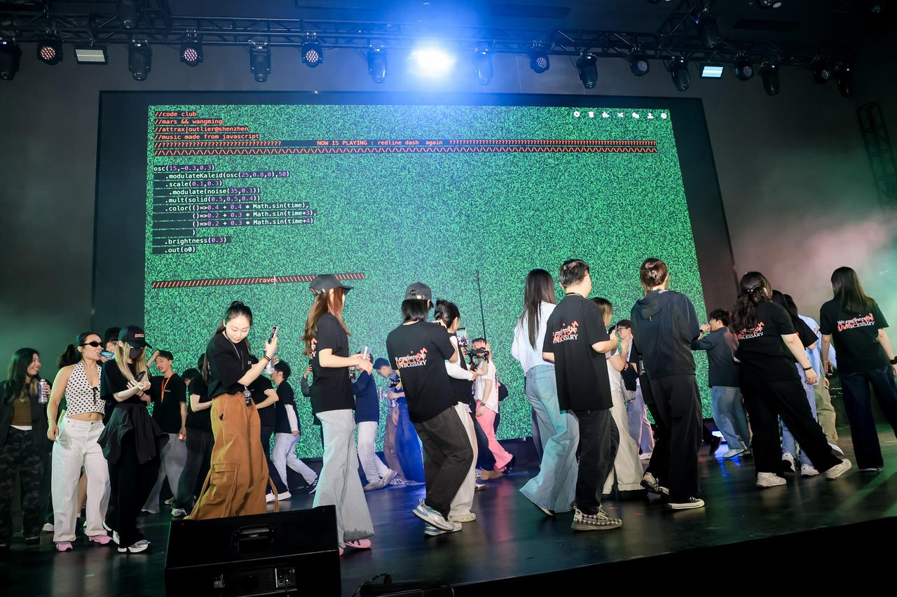

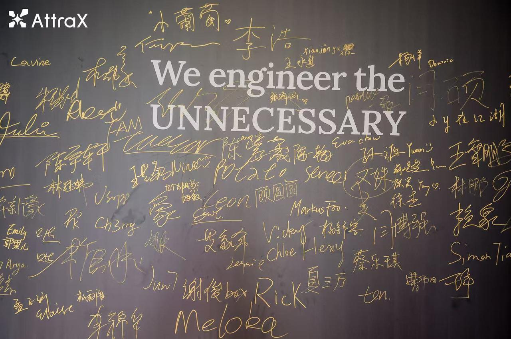

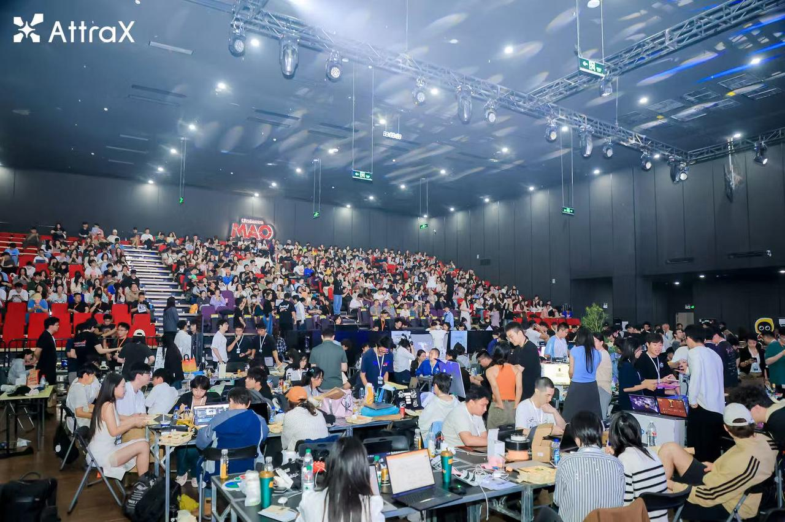

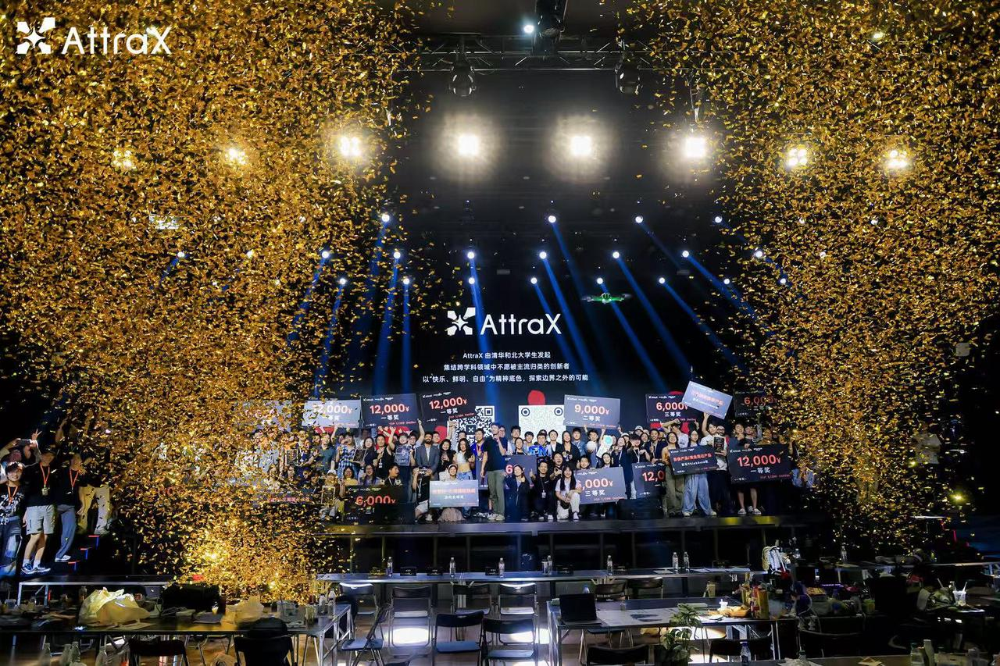

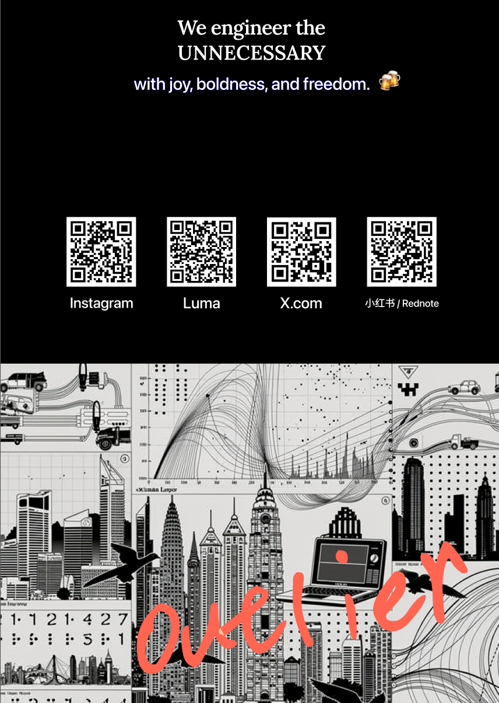